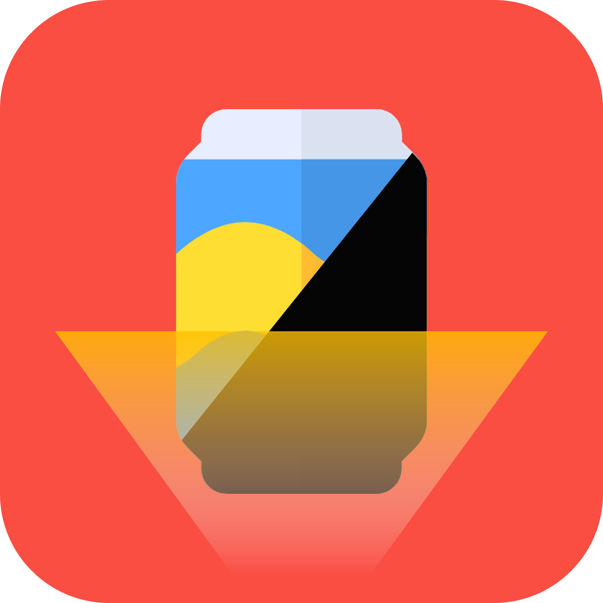
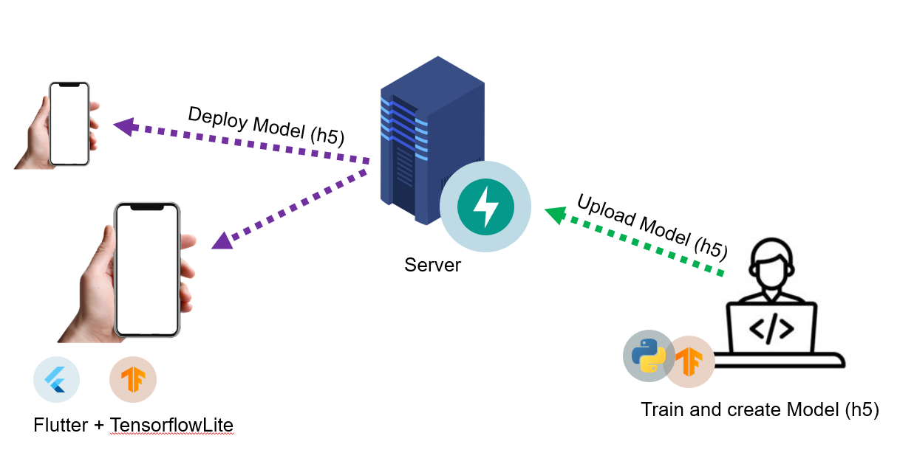
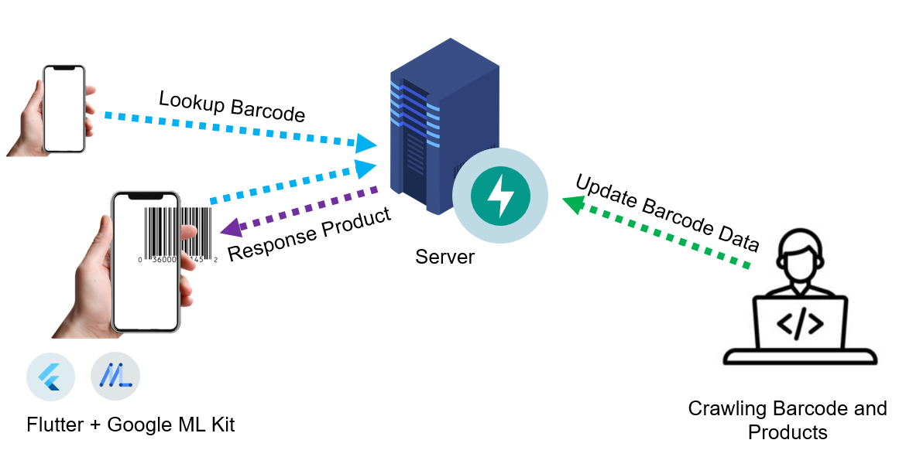

<div align="center">



<!-- omit in toc -->
# 2022-SolutionChallenge-CanDrink

We are aim to a world where visually impaired are able to choice and enjoy drink what they want.

</div>

<br>
<br>

## Summary

Of the many canned drinks, there are only two types of drinks that can be classified in braille: 'just drink' and 'soda'. This is what canned drinks look like from a visually impaired's point of view. So we created a service that helps visually impaired people choose their favorite drinks.

With **CanDrink**, visually impaired can get free of the inconvenience of failure of recognizing cans 

You can see more detail on **[Intoduction YouTube Link](https://www.youtube.com/embed/zg14ulTd5mM)**!

<br><br>

<!-- omit in toc -->
# [ANNOUNCE] Congrats!! This project has been shortlisted to the global TOP 50!

Click image to see more detail!

[](https://developers.google.com/community/gdsc-solution-challenge/winners)

<br><br>

<!-- omit in toc -->
# Table of Contents

- [Features](#features)
- [CanDrink Server](#candrink-server)
  - [Getting Started](#getting-started)
    - [Installation](#installation)
    - [Run](#run)
  - [Directory](#directory)
- [Architecture](#architecture)
  - [Object Detection](#object-detection)
  - [Barcode Detection](#barcode-detection)
- [CanDrink Client](#candrink-client)
  - [Getting Started](#getting-started-1)
    - [Prerequisite](#prerequisite)
    - [Installation](#installation-1)
    - [Run](#run-1)
- [Crawler](#crawler)
  - [Getting Started](#getting-started-2)
    - [Installation](#installation-2)
    - [Run](#run-2)
- [ML Notebook](#ml-notebook)
  - [Environment](#environment)
  - [Setup CUDA](#setup-cuda)
    - [Install nvidia driver](#install-nvidia-driver)
    - [Install CUDA 11.2](#install-cuda-112)
    - [Install cuDNN 8.1.0](#install-cudnn-810)
    - [Verify Installation](#verify-installation)

<br><br>

# Features
1. Find out the brand
2. Search the drink
3. Check the expiration date

<br><br>

# CanDrink Server


> CanDrink Server

## Getting Started  

### Installation

```sh
git clone https://github.com/GDSC-DEU/2022-SolutionChallenge-CanDrink
cd server
```

### Run

```sh
docker-compose up
```

## Directory

```sh
app
├─ routes
│  ├─ views.py
├─ tffile
│  ├─ models #model files
├─ main.py
├─ run.py
```

<br><br>

# Architecture

## Object Detection
Object detection is run with TensorFlow Lite. Model files will be distributed with constant updates. Therefore, we added deploy server for model file distribution. Client checks model is updated and download from server.



## Barcode Detection



<br><br>

# CanDrink Client


<!-- ML Kit -->

## Getting Started

### Prerequisite

You need flutter SDK to run this project.

See **[Flutter Installation](https://docs.flutter.dev/get-started/install)**.

### Installation

```
git clone https://github.com/GDSC-DEU/2022-SolutionChallenge-CanDrink
cd client
code .
```
And you can see VSCode with this project.

### Run

Press `F5` to run on VSCode.

<br><br>

# Crawler


## Getting Started  

### Installation

```
git clone https://github.com/GDSC-DEU/2022-SolutionChallenge-CanDrink

pip install -r requirements.txt

echo "KEYWORD=[serch keyword]" >> .env
echo "KEY=[save key]" >> .env
echo "NAME=[forlder name]" >> .env
```

### Run

```
python crawler.py
```

<br><br>

# ML Notebook

## Environment

* OS: Ubuntu 20.04.4 LTS x86_64
* CPU: 11th Gen Intel CPU
* GPU: NVIDIA 3080 Ti with 12GB VRAM
* GPU Driver Version: 470.129.06
* CUDA Version: 11.2
* cuDNN Version: 8.1.0

## Setup CUDA

If you have nvidia GPU, you can accelerate training speed rapidly. This section tells you how to set up a GPU. For more details about requirements, please see [TensorFlow Installation Guide](https://www.tensorflow.org/install/pip)

### Install nvidia driver
Go to https://www.nvidia.com/en-us/geforce/drivers/ and scroll down to **MANUAL DRIVER SEARCH**, search your GPU's driver. You can find various versions i.e. `470`, `510`

TensorFlow requires `450.80.02+`, but closest version may get better result.

After complete download, run file as root.
```sh
sudo sh NVIDIA-Linux-x86_64-470.129.06.run
```

... Occasionally you can see this error:
> `An NVIDIA kernel module 'nvidia-drm' appears to already be loaded ...`

Please ensure GUI is disabled. If you are using Ubuntu Desktop 20.04, `sudo service gdm3 stop` helps to resolve this error.


### Install CUDA 11.2
Go to https://developer.nvidia.com/cuda-11.2.0-download-archive?target_os=Linux&target_arch=x86_64&target_distro=Ubuntu&target_version=2004&target_type=runfilelocal and check your OS and architecture. Select **Installer Type** to `runtime (local)` and follow the instruction.

> Note: You must uncheck nvidia-driver-460, this option may causes installation error.

### Install cuDNN 8.1.0
Go to nvidia cuDNN archive: https://developer.nvidia.com/rdp/cudnn-archive and download **8.1.0 for CUDA 11.0, 11.1 and 11.2**.

### Verify Installation
Use `nvidia-smi` command to check driver version and CUDA version.

... And run python code below for ensure the tensorflow correctly recognize your GPU device.

```python
>>> import tensorflow as tf
>>> tf.config.list_physical_devices('GPU')
```

When installation was successfully done, you can see following result:

```
[PhysicalDevice(name='/physical_device:GPU:0', device_type='GPU')]
```